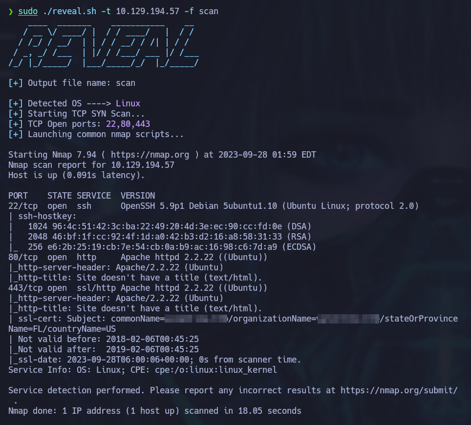

# Reveal
A simple bash script that discovers a given host's open ports and OS using NMAP and TTL information.



## Usage

```bash
Usage: ./reveal.sh -t ip_address [-f output_file]
Options:
 -h, --help      Display this help message
 -v, --verbose   Enable verbose mode
 -f, --file      FILE Specify an output file
 -t, --target    Specify target ip address
 -U, --udp       Include UDP ports scan
```


